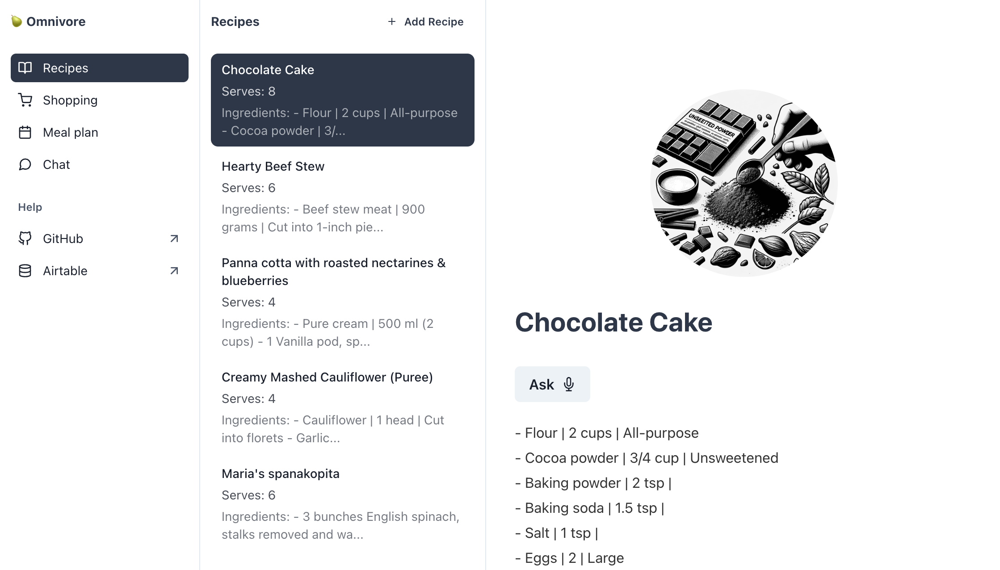

# Omnivore



## About

Omnivore is an ongoing attempt to build an Omni meal planning app - whatever that may be! You can read more about the design behind [here](https://joshuacrowley.com/study/omnivore).

At present this Create react web app uses the latest OpenAI `GPT-4o` model, plus shows basic implementations of

- Assistant api
- File search (with Vector storage)
- Function calling
- Vision
- Image generation
- Chat completion
- Text to speech
- Speech to text

I plan to upgrade the app with examples of how to use `GPT-4o`'s new audio and video capabilities in the near future.

Omnivore should only be run locally off your home computer/network and not deployed remotely, otherwise you'll expose your ENV variables. Omnivore uses [Airtable](https://airtable.com/) as backend to help you get started. You can also access your shopping list, meal and recipes via the [Airtable mobile app](https://apps.apple.com/us/app/airtable/id914172636).

I hope you have a few fun weekends with it, learn about these amazing OpenAI APIs, and get inspired to designing your own amazing Omni apps. And hopefully get some cooking done too.

## Getting started

### 1. Clone the repo

```shell
git clone https://github.com/joshuacrowley/omnivore.git
cd omnivore
```

### 2. Copy the .env.example file, and save it as .env.local.

### 3. Create your [OpenAI API key](https://platform.openai.com/api-keys)

It will need read and write permissions. Set it as `REACT_APP_OPENAI_API_KEY` in .env.local.

### 3. Create your [assistant ID](https://platform.openai.com/assistants)

Set it as `REACT_APP_ASSISTANT_ID` in .env.local.

### 4. Set a [monthly budget](https://platform.openai.com/settings/organization/limits)

A good idea while we're still experimenting!

### 5. Copy the Omnivore (v1) [Airtable Base](https://airtable.com/appdqcBRR3roXoUQd/shrWBkBRSTnR6xfZs) to your Airtable account


### 6. Create an Airtable [personal access token](https://airtable.com/create/tokens)

Needs access to your copied base and `data.records:read` and `data.records:write`. Set it as `REACT_APP_AIRTABLE_API_KEY` in .env.local.

### 7. Copy the Airtable Base ID

You can pluck it from the url when viewing your base https://airtable.com/app.../. Set it as `REACT_APP_AIRTABLE_BASE` in .env.local.

### 8. Install dependencies

```shell
npm install
```

### 9. Run

```shell
npm run start
```

### 10. Navigate to [http://localhost:3000](http://localhost:3000).

### 11. Once you've added some recipes, you can create files to upload to your assistant.

```shell
npm run makeFiles
```

## Contributions

Small or big are welcome :)

## Feedback

You can reach me here -> [https://twitter.com/ojschwa](https://twitter.com/ojschwa).

## Resources

- A Next.js [Openai assistants quickstart](https://github.com/openai/openai-assistants-quickstart)
